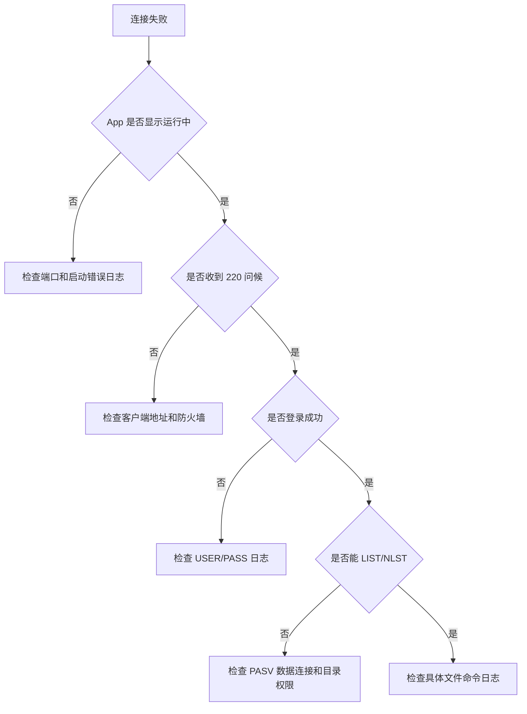

# 使用与排查

## 启动流程

1. 打开 `LocalFTP.app`。
2. 选择共享目录。
3. 设置端口，默认建议使用 `2121`。
4. 设置用户名和密码。
5. 点击“启动”。
6. 使用 FTP 客户端连接 `127.0.0.1:端口`。

## 常见问题

### 启动失败

优先检查：

- 端口是否被占用。
- 端口是否小于 1024。低端口通常需要管理员权限。
- 共享目录是否存在。

### 登录失败

检查：

- 用户名是否一致。
- 密码是否一致。
- 客户端是否连接到了正确端口。

### 能登录但不能列目录

检查：

- FTP 客户端是否启用了被动模式。
- 防火墙是否阻止了被动数据端口。
- 共享目录是否有读取权限。

## 日志排查

日志文件：

```text
~/Library/Logs/LocalFTPServer/local-ftp.log
```

日志会记录：

- 服务启动/停止。
- 监听端口和共享目录。
- 客户端命令。
- 服务端响应。
- 认证成功/失败。
- 数据传输字节数。
- 监听和连接错误。

## 排查流程


