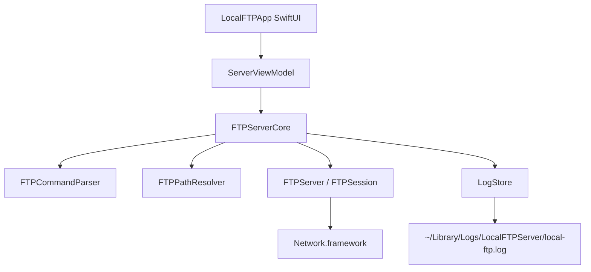

# 架构设计

## 设计目标

LocalFTPServer 使用分层设计，把 FTP 协议、路径安全、日志和 macOS UI 解耦，避免 UI 与网络协议逻辑互相污染。

## 模块划分

## 分层职责

- `LocalFTPApp`：负责界面、用户输入、目录选择、启动/停止按钮和日志展示。
- `FTPServerCore`：负责 FTP 协议实现，不依赖 SwiftUI。
- `FTPCommandParser`：把控制连接中的文本命令解析为结构化命令。
- `FTPPathResolver`：把 FTP 路径映射到本地文件路径，并阻止逃逸共享根目录。
- `LogStore`：保存内存日志并写入日志文件。
- `FTPServer`：管理监听端口和客户端会话。
- `FTPSession`：处理单个客户端控制连接和数据连接。

## 关键设计决策

- 使用 SwiftPM 而不是 Xcode 工程，减少工程文件和打包体积。
- 使用 Network.framework，不引入第三方依赖。
- FTP 核心逻辑作为 library target，便于测试和后续复用。
- 日志为核心能力，而不是 UI 附加功能，服务层直接记录状态与处理细节。
