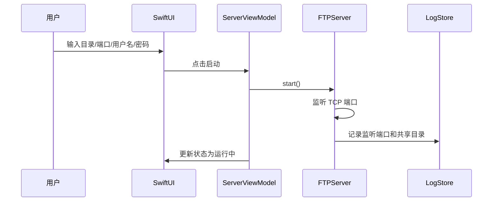
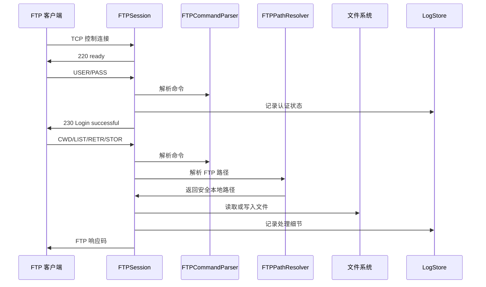
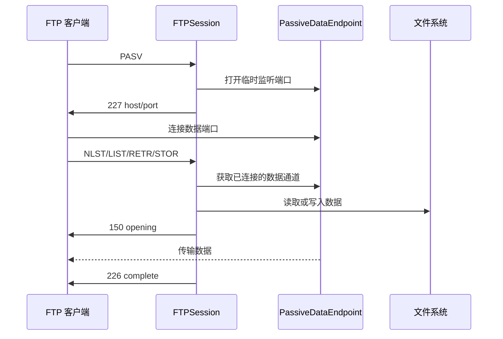

# 核心数据流

## 启动数据流

```mermaid
sequenceDiagram
    participant User as 用户
    participant UI as SwiftUI
    participant VM as ServerViewModel
    participant Server as FTPServer
    participant Log as LogStore

    User->>UI: 输入目录/端口/用户名/密码
    UI->>VM: 点击启动
    VM->>Server: start()
    Server->>Server: 监听 TCP 端口
    Server->>Log: 记录监听端口和共享目录
    VM->>UI: 更新状态为运行中
```

## FTP 控制连接数据流

```mermaid
sequenceDiagram
    participant Client as FTP 客户端
    participant Session as FTPSession
    participant Parser as FTPCommandParser
    participant Resolver as FTPPathResolver
    participant FS as 文件系统
    participant Log as LogStore

    Client->>Session: TCP 控制连接
    Session->>Client: 220 ready
    Client->>Session: USER/PASS
    Session->>Parser: 解析命令
    Session->>Log: 记录认证状态
    Session->>Client: 230 Login successful
    Client->>Session: CWD/LIST/RETR/STOR
    Session->>Parser: 解析命令
    Session->>Resolver: 解析 FTP 路径
    Resolver->>Session: 返回安全本地路径
    Session->>FS: 读取或写入文件
    Session->>Log: 记录处理细节
    Session->>Client: FTP 响应码
```

## 被动数据连接数据流

```mermaid
sequenceDiagram
    participant Client as FTP 客户端
    participant Session as FTPSession
    participant Passive as PassiveDataEndpoint
    participant FS as 文件系统

    Client->>Session: PASV
    Session->>Passive: 打开临时监听端口
    Session->>Client: 227 host/port
    Client->>Passive: 连接数据端口
    Client->>Session: NLST/LIST/RETR/STOR
    Session->>Passive: 获取已连接的数据通道
    Session->>FS: 读取或写入数据
    Session->>Client: 150 opening
    Passive-->>Client: 传输数据
    Session->>Client: 226 complete
```
